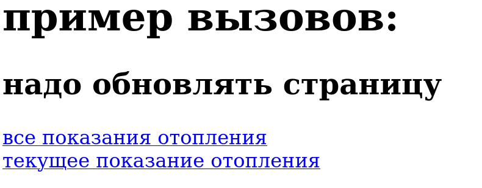

# utility-meter
utility-meter - это программа для подачи и просмотра 
показаний счетчиков отопления, горячей и холодной воды

## Сборка репозитория и локальный запуск
___
Выполните в консоли:

1. Клонируйте репозиторий с github

`git clone https://github.com/snow-month/utility-meter.git`

2. Собираем war



```
BUILD SUCCESSFUL in 221ms
3 actionable tasks: 3 up-to-date
23:16:35: Execution finished 'war'.

```
3.Запуск программы

Переходим в корневую папку проекта и в консоли запускаем команду

```
user@pc:~/IdeaProjects/utility-meter$ docker compose up -d
```


